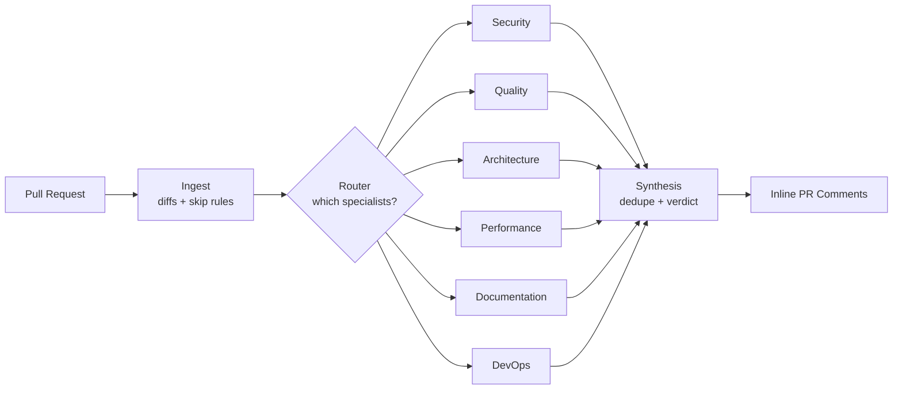

# AI Council Code Review

[](https://github.com/Sosoka-Labs/ai-council-code-review/actions/workflows/ci.yml)
[](https://www.python.org/downloads/)
[](https://opensource.org/licenses/MIT)
[](https://github.com/Sosoka-Labs/ai-council-code-review/releases)

**A council of specialist AI agents that reviews your pull requests — and reads the rest of your repo to catch what a diff alone can't.**

Most AI reviewers see only the diff. AI Council dispatches six domain specialists — security, quality, architecture, performance, documentation, and devops — that browse your repository in real time, reading unchanged files to catch consistency, security, and architectural impact a single-pass reviewer misses. A router gates which specialists run on each PR to keep cost low, and a synthesis agent dedupes their findings into one coherent review posted as inline comments.

Every specialist can also be bound to **Skills you define in your own repository** — versioned markdown that encodes your conventions, guidelines, and known pitfalls — so each agent reviews your code with the context your team actually relies on.

---

## Why AI Council vs. a single-agent reviewer

- **Six focused specialists, not one generalist.** Each agent reasons about one domain at the right temperature and depth — instead of a single prompt trying to be a security, performance, and docs expert at once.
- **It reads beyond the diff.** When a GitHub token is present, agents browse unchanged files on demand — so the documentation agent can check whether your `README.md` still matches the signature you just changed, and the architecture agent can trace cross-file impact.
- **Routed for cost.** A fast, cheap router decides which specialists a PR actually needs, so a typical change runs a couple of agents — not all six — under a configurable per-PR budget.
- **One review, not a wall of noise.** The synthesis agent deduplicates overlapping findings, resolves conflicts, and emits a single verdict: `approve`, `comment`, or `request_changes`.
- **Teach it your codebase.** Bind [Skills](docs/skills.md) — versioned markdown files you define in your own repository — to any agent, giving it project-specific context, conventions, and guidelines whenever it reviews your code.

---

## How it works



The router selects only the specialists a PR needs; the selected ones run **in parallel**, then converge on synthesis. One agent failing does not crash the run — the others continue. See [docs/architecture.md](docs/architecture.md) for the full state machine.

---

## Agents at a glance

| Agent | Focus | Triggers when the diff touches… |
|-------|-------|---------------------------------|
| **Security** | Auth bypasses, injection, secrets, unsafe deserialization, missing validation | auth, crypto, user input, secrets, deps, API endpoints, data persistence |
| **Quality** | Logic bugs, error handling, type safety, missing tests, complexity | significant code changes, error handling, tests, typing |
| **Architecture** | Cross-file impact, public-API consistency, docs/migration drift | multiple files/modules, public APIs, data models, configuration |
| **Performance** | N+1 queries, unbounded result sets, O(n²) loops, sync I/O on hot paths | DB/ORM queries, loops over collections, request handlers, `repositories/`, `dao/` |
| **Documentation** | Stale docstrings vs. changed signatures, missing docs, changelog gaps | `*.md`, public signature changes, new CLI flags/env vars, new exports |
| **DevOps** | GitHub Actions, Dockerfiles, Terraform, shell scripts, CI/CD hardening | `.github/workflows/*`, `Dockerfile`, `*.tf`, `*.sh`, CI YAML |

A **router** gates which specialists run per PR and picks the review depth; a **synthesis** agent dedupes findings and emits the verdict. Full mandates, router logic, and cross-file behavior → see [docs/agents.md](docs/agents.md).

---

## Quick Start

Add AI Council to any repository in three steps.

### 1. Add the workflow

Copy this file to `.github/workflows/ai-council-review.yml`:

```yaml
name: AI Council Code Review

on:
  pull_request:
    types: [opened, synchronize, reopened, ready_for_review]
    branches: [main]

permissions:
  contents: read
  pull-requests: write

concurrency:
  group: ${{ github.workflow }}-${{ github.event.pull_request.number }}
  cancel-in-progress: true

jobs:
  ai-review:
    name: AI Council Review
    runs-on: ubuntu-latest
    timeout-minutes: 15
    if: github.event.pull_request.draft == false

    steps:
      - name: Checkout PR HEAD
        uses: actions/checkout@v4
        with:
          ref: ${{ github.event.pull_request.head.sha }}
          fetch-depth: 0

      - name: Fetch base branch
        run: git fetch origin ${{ github.event.pull_request.base.ref }} --depth=100

      - name: Setup Python
        uses: actions/setup-python@v5
        with:
          python-version: '3.11'

      - name: Install uv
        uses: astral-sh/setup-uv@v5
        with:
          version: '0.6.0'

      - name: Install dependencies
        run: uv pip install --system -e .

      - name: Run AI Council Review
        env:
          GITHUB_TOKEN: ${{ secrets.GITHUB_TOKEN }}
          PR_NUMBER: ${{ github.event.pull_request.number }}
          REPO: ${{ github.repository }}
          BASE_SHA: ${{ github.event.pull_request.base.sha }}
          HEAD_SHA: ${{ github.event.pull_request.head.sha }}
          BASE_REF: ${{ github.event.pull_request.base.ref }}
          HEAD_REF: ${{ github.event.pull_request.head.ref }}
          OPENAI_API_KEY: ${{ secrets.OPENAI_API_KEY }}
          ANTHROPIC_API_KEY: ${{ secrets.ANTHROPIC_API_KEY }}
          FIREWORKS_API_KEY: ${{ secrets.FIREWORKS_API_KEY }}
        run: |
          python -m ai_council_review \
            --pr-number "$PR_NUMBER" \
            --repo "$REPO" \
            --base-sha "$BASE_SHA" \
            --head-sha "$HEAD_SHA" \
            --base-ref "$BASE_REF" \
            --head-ref "$HEAD_REF"
```

### 2. Add your API key

In **Settings › Secrets and variables › Actions**, add `OPENAI_API_KEY` — that is all the default configuration needs. `ANTHROPIC_API_KEY` and `FIREWORKS_API_KEY` are optional alternatives; the workflow passes whichever are present, and LangChain reads them automatically.

### 3. (Optional) Customize behavior

Drop `.ai-council/config.yaml` into your repo root to tune agents, models, and rules. Everything has a default — the tool works with zero config. See the [example config](examples/.ai-council/config.yaml) and [docs/configuration.md](docs/configuration.md).

Open a pull request and AI Council will post a review.

---

## Configuration

`.ai-council/config.yaml` (optional) tunes review settings, per-agent models and providers, prompt overrides, and skip rules. Override any value with `AI_COUNCIL__*` environment variables. Every option has a sensible default.

→ See [docs/configuration.md](docs/configuration.md)

## Skills

Skills are versioned `SKILL.md` files **you add to your own repository** under `.ai-council/skills/` to inject project-specific knowledge — conventions, known pitfalls, domain rules — into a specialist's prompt. They are **opt-in**: no agent has a skill bound by default. You attach them in your config per agent, with a `"*"` sentinel, or as a repo-wide default. This repo ships four example skills (for the security, performance, documentation, and devops agents) you can copy as a starting point.

→ See [docs/skills.md](docs/skills.md)

## Cost control

A default **$5.00 per-PR budget** is enforced via router gating and token estimation; hard `max_files` / `max_lines` / `max_diff_size` limits skip oversized PRs. A debug mode dumps the full review state (secrets stripped) for auditing spend.

→ See [docs/cost-control.md](docs/cost-control.md)

## Security

API keys live in GitHub Secrets and are never logged. Fork PRs are skipped by default because their token is read-only, and AI Council deliberately does **not** use `pull_request_target`. Drafts, labeled PRs, and oversized diffs are filtered automatically.

→ See [docs/security.md](docs/security.md)

## Providers

OpenAI is the default provider (`gpt-4.1` for specialists, `gpt-4.1-mini` for router and synthesis). Anthropic and Fireworks are first-class alternatives, mixable per agent. Shorthand model aliases keep config readable.

→ See [docs/providers.md](docs/providers.md)

---

## Known Limitations

- **Stateless** — each PR is reviewed from scratch; AI Council does not learn from past reviews.
- **Inline comments land only on changed hunks** — GitHub drops comments outside the lines a PR touches, so findings about unchanged code appear in the summary instead.
- **Router-gated cost ceiling** — on `standard` depth the router caps specialists (4), so a relevant agent can be skipped on a borderline change. Raise `review_depth: deep` or force the agent on in config.
- **GitHub Actions only** — no IDE or CLI interface today.
- **Three providers** — OpenAI, Anthropic, and Fireworks; no custom provider support yet.
- **Large PRs skipped by default** (50 files / 2000 lines) to control cost and runtime.
- **Language-agnostic, not language-aware** — agents infer language from file extensions; there are no language-specific parsers.

---

## Roadmap

A one-line **GitHub Marketplace Action** (drop-in `uses:` step) and **PyPI packaging** are planned, to reduce installation from the full workflow above to a single line.

---

## Documentation

| Doc | What's inside |
|-----|---------------|
| [docs/agents.md](docs/agents.md) | The six specialists in depth, how the router decides, cross-file awareness, bound skills. |
| [docs/configuration.md](docs/configuration.md) | Full `config.yaml` reference, env-var overrides, model aliases, mixed-provider and prompt-override examples. |
| [docs/skills.md](docs/skills.md) | The Skills system — layout, frontmatter, binding patterns, bundled skills, token budgets. |
| [docs/cost-control.md](docs/cost-control.md) | Budget, typical costs, hard limits, timeouts, debug mode. |
| [docs/providers.md](docs/providers.md) | OpenAI / Anthropic / Fireworks setup and how to pick models. |
| [docs/architecture.md](docs/architecture.md) | The LangGraph state machine and data flow, for contributors. |
| [docs/security.md](docs/security.md) | Secrets handling, fork behavior, PR filtering. |
| [docs/troubleshooting.md](docs/troubleshooting.md) | Common errors and fixes. |

Contributor conventions, the agent architecture, and local development setup live in [`AGENTS.md`](AGENTS.md) and [`CONTRIBUTING.md`](CONTRIBUTING.md).

---

## Branching & Release Strategy

This project uses a **Gitflow-lite** model with two long-lived branches:

| Branch | Purpose |
|--------|---------|
| `develop` | Integration branch. All feature and bugfix branches target `develop`. CI gates run here. |
| `main` | Release branch. Only receives merges from `develop` when a release is cut. Tags are always from `main`. |

### Contributor flow

```
develop   ←── feature/my-feature   (PR into develop, CI must pass)
   │
   └── (merge to main at release time, then tag)
main      ←── v1.2.0 tag
```

1. Branch from `develop`: `git checkout -b feature/my-feature develop`
2. Open a PR targeting `develop`. CI (tests, lint, type check) must be green.
3. After review, merge into `develop`.
4. At release time, `develop` is merged to `main` and a `vX.Y.Z` tag is pushed from `main`.

### Consumer guidance

Pin to a release tag rather than `main` or `develop` in your workflow:

```yaml
# Pin to a stable release
- name: Checkout AI Council
  uses: actions/checkout@v4
  with:
    repository: Sosoka-Labs/ai-council-code-review
    ref: v0.1.0          # <-- always pin to a release tag
    path: ai-council
```

`develop` can include in-progress work and is not guaranteed to be stable. `main` is stable but is only updated at release boundaries. Pinning to a tag is the only guarantee of a reproducible, reviewed build.

New releases are announced in [CHANGELOG.md](CHANGELOG.md) and [GitHub Releases](https://github.com/Sosoka-Labs/ai-council-code-review/releases).

---

## License

MIT License. See [LICENSE](LICENSE) for details.

---

*Project status: v0.1.0 — initial public release. APIs and config may still change before 1.0.*
