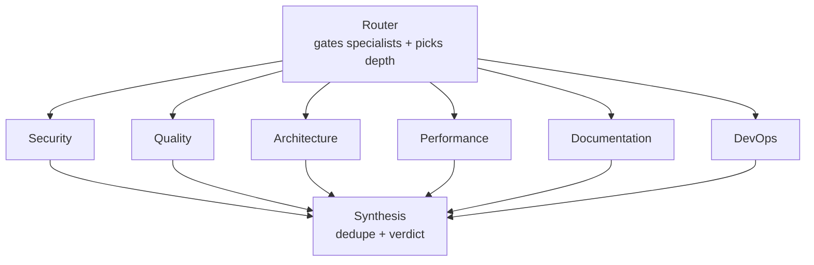

# Agents

The specialist council, plus the router that gates it and the synthesis agent that merges its output.

← Back to [README](../README.md)

---

AI Council is built from **six specialist agents**, a **router** that decides which specialists run on a given PR, and a **synthesis** agent that merges their output into one review. The roster is registry-driven (`src/ai_council_review/llm/agents/registry.py`) — the router catalog, synthesis categories, and valid-agent filter all derive from it automatically, so a single source of truth keeps everything in sync.

## The six specialists

| Agent | Focus | Triggers when the diff touches… |
|-------|-------|---------------------------------|
| **Security** | Auth bypasses, injection, secrets leakage, unsafe deserialization, missing input validation | auth, crypto, user input, injection, secrets, deps, API endpoints, data persistence |
| **Quality** | Logic bugs, error handling, type safety, missing tests, complexity, code smells | significant code changes, error handling, tests, typing |
| **Architecture** | Cross-file impact, public-API consistency, docs/migration drift, data models | multiple files/modules, public APIs, data models, configuration |
| **Performance** | N+1 queries, unbounded result sets, O(n²) loops, sync I/O on hot paths, missing caching/indexes | DB/ORM queries, loops over collections, request handlers, `repositories/`, `dao/`, `queries/` |
| **Documentation** | Stale docstrings vs. changed signatures, missing docs on new public APIs, changelog gaps, broken examples | `*.md`, public signature changes, new CLI flags/env vars, new exports |
| **DevOps** | GitHub Actions, Dockerfiles, Terraform, shell scripts, CI/CD correctness and hardening | `.github/workflows/*`, `Dockerfile`, `*.tf`, `*.sh`, CI YAML |

Each specialist returns a list of `Finding` objects tagged with a severity and a confidence score. A single parameterized runner (`llm/agents/specialist.py`) implements all six — they differ only by prompt and trigger.

## The coordinators

| Coordinator | Role |
|-------------|------|
| **Router** | Reads the PR title, description, and changed files to decide which specialists are needed and how deep the review goes. Falls back to all agents on parse failure. |
| **Synthesis** | Deduplicates findings across agents, resolves conflicts, prioritizes by severity, and emits the final summary and verdict (`approve` / `comment` / `request_changes`). |

## How the council fans out and back in

The specialists the router selects run **in parallel** (LangGraph fan-out), then converge on synthesis (fan-in). One agent failing does not crash the run — the others continue.

## How the router decides

Each specialist's trigger conditions (its `router_hint` in the registry) are injected into the router prompt, so the router knows when to call each one. It combines those hints with model reasoning over the PR's files and intent.

- You can force agents on or off per agent via `enabled` in `config.yaml`.
- On `standard` depth, the router caps the number of parallel specialists (4) to keep cost predictable.
- Setting `review_depth: deep` lifts the cap so all six can run on changes that warrant it.

When [Skills](skills.md) are present, the router also receives a descriptions-only catalog of bound skills, so domain knowledge improves routing accuracy.

## Cross-file awareness

When a GitHub token is present, any specialist can run a bounded agentic tool loop, calling the Repository Browser to read **unchanged** files on demand for cross-file analysis. Without a token (dry-run, fork, or local diff-only mode) the agents degrade gracefully to reviewing the diff alone.

Typical reads:

| Scenario | Files the agent may read |
|----------|--------------------------|
| New public API endpoint | `README.md`, `docs/API.md`, `openapi.yaml` |
| New function without tests | `tests/`, `test_*` files in related directories |
| Auth logic modified | Other files in `auth/`, `middleware/` directories |
| Dependency added | `requirements.txt`, `package.json`, `poetry.lock` |
| Model/DB schema changed | Migration files in `migrations/` |
| Config key added | `.env.example`, `config.yaml`, `docker-compose.yml` |

## Bound skills

Several specialists ship with a bound demo [Skill](skills.md) that encodes domain knowledge:

| Skill | Bound to | Encodes |
|-------|----------|---------|
| `oauth-pitfalls` | security | OAuth 2.0 / JWT / PKCE review guidance |
| `n-plus-one` | performance | N+1 query and ORM access-pattern detection |
| `docstring-style` | documentation | Google-style docstring conventions |
| `github-actions-hardening` | devops | GitHub Actions security and correctness |

See [docs/skills.md](skills.md) for how to author and bind your own.

---

← Back to [README](../README.md)
