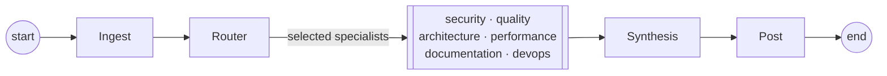

# Architecture

The LangGraph state machine and data flow, for contributors and the curious.

← Back to [README](../README.md)

---

AI Council is a **stateless, multi-agent code review system** triggered by GitHub Actions. It ingests a PR, routes to specialist LLM agents, and posts inline review comments back to GitHub. There is no database, no vector store, and no memory between runs — each PR is reviewed from scratch using only the GitHub API and prompts.

## The LangGraph workflow

The state machine lives in `src/ai_council_review/llm/graph.py`. The router selects which specialists run; the selected specialists execute in parallel (fan-out) and converge on synthesis (fan-in).

## Node responsibilities

| Node | Module | Responsibility |
|------|--------|----------------|
| **Ingest** | `github/ingestor.py` | Fetch PR metadata + changed files with unified diffs. Apply skip rules (draft, size limits, label filters, glob patterns). |
| **Router** | `llm/agents/router.py` | Use a fast/cheap model to decide which agents run and at what depth. Falls back to all agents on parse failure. |
| **Specialists** | `llm/agents/specialist.py` | Each receives PR metadata + diffs, may call `RepositoryBrowser` to read unchanged files, and returns a list of `Finding` objects. One parameterized runner serves all six. |
| **Synthesis** | `llm/agents/synthesis.py` | Deduplicate and merge findings across agents; produce the final verdict (`approve` / `comment` / `request_changes`). |
| **Post** | `github/publisher.py` | Convert `Finding` objects to inline GitHub review comments. Skips silently on fork PRs (read-only token). |

## Central state object

`ReviewState` (in `models/state.py`) is the LangGraph state dict passed between all nodes. Key fields:

- `changed_files: list[FileInfo]` — diffs from ingest.
- `agent_outputs: dict[str, list[Finding]]` — keyed by agent name, fan-in merged by a LangGraph reducer (`_merge_agent_outputs`).
- `verdict: str` — the final decision.
- `costs: list[CostRecord]` — token/cost tracking per LLM call.

## Registry-driven graph

The roster is declared once in `src/ai_council_review/llm/agents/registry.py` (`SPECIALIST_AGENTS`). `build_graph()` reads that tuple to produce each specialist node, its conditional edge from the router, and its fan-in edge to synthesis. Adding a specialist is a one-line `AgentSpec` append — see [`AGENTS.md`](../AGENTS.md) for the full procedure.

## Inline comment positioning

`utils/patch_parser.py` maps `(file, line_number)` to a position within the unified diff hunk. This is the most fragile part of the system: GitHub silently drops comments that fall outside changed hunks, so findings about unchanged code are reported in the summary instead of inline.

## LLM provider abstraction

`llm/providers/factory.py` returns a `BaseChatModel` for a given `AgentConfig`. Because all agents use the `BaseChatModel` interface, provider switching requires no agent-level changes. See [docs/providers.md](providers.md).

---

← Back to [README](../README.md)
